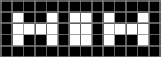

# Conway's Game of Life

This is a HTML, JS, & CSS implementation of [Conway's Game of Life](https://en.wikipedia.org/wiki/Conway%27s_Game_of_Life).
 
Feel free to copy/fork/contribute.

## How to Run

Any modern browser should support running this natively by opening `src/index.html`.

## Example Patterns

<table>
  <tr>
    <th>Name</th>
    <th>Start</th>
    <th>Interaction</th>
    <th>End</th>
    <th>Evolution</th>
  </tr>
  <tr>
    <td>Seed Pulsar</td>
    <td></td>
    <td>N/A</td>
    <td></td>
    <td>30</td>
  </tr>
  <tr>
    <td>Seed Pentadecathlon</td>
    <td></td>
    <td>N/A</td>
    <td></td>
    <td>15</td>
  </tr>
  <tr>
    <td>Bloom</td>
    <td></td>
    <td></td>
    <td></td>
    <td>16</td>
  </tr>
</table>